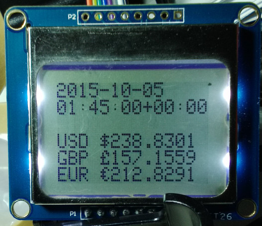

# esp-pcd-bitcoin
ESP8266 connected to PCD8544/5110 monochrome LCD display showing Bitcoin prices

## Hardware Parts ##

* [Adafruit Huzzah ESP8266](https://www.adafruit.com/products/2471)
* [Adafruit PCD8544/5110 display](https://www.adafruit.com/product/338)
* [Adafruit USB to TTL serial cable](https://www.adafruit.com/products/954)

## Connections ##

USB TTL    |Huzzah ESP8266|PCD8544/Nokia 5110 |Description
-----------|-----------|-----------|-------------------------------------------------------------
           |GND        |GND        |Ground
           |3V         |VCC        |3.3V from Huzzah to display
           |14         |CLK        |Output from ESP SPI clock
           |13         |DIN        |Output from ESP SPI MOSI to display data input
           |12         |D/C        |Output from display data/command to ESP
           |#5         |CS         |Output from ESP to chip select/enable display
           |#4         |RST        |Output from ESP to reset display
           |15         |LED        |3.3V to turn backlight on, GND off
GND (blk)  |GND        |           |Ground
5V  (red)  |V+         |           |5V power from PC or charger
TX  (green)|RX         |           |Serial data from IDE to ESP
RX  (white)|TX         |           |Serial data to ESP from IDE

## Dependencies ##

* [Fork of Adafruit PCD8544 library with changes for ESP8266]
  (https://github.com/bbx10/Adafruit-PCD8544-Nokia-5110-LCD-library.git). Use the
  esp8266 branch!
* Adafruit GFX library. Use the Arduino IDE Library Manager to get the latest version
* Arduino JSON library. Use the Arduino IDE Library Manager to get the latest version
